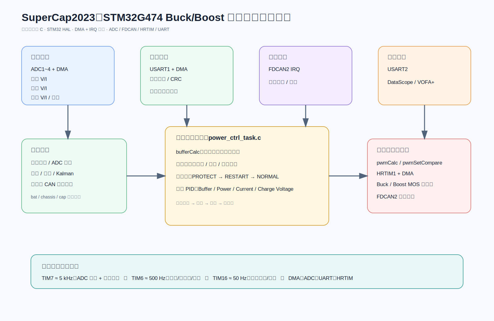

# SuperCap2023：STM32G474 超级电容功率控制固件

> 源码依据：`D:\Users\86137\Desktop\SuperCap2023(1)\SBSuperCap_7_16`。配套架构图：`SuperCap2023_架构图.svg`。

## 30 秒开场

这是一个基于 **STM32G474 Cortex-M4** 的裸机实时超级电容 Buck/Boost 控制固件。ADC + DMA 持续采集电池、底盘和电容端的电压/电流；裁判系统和底盘状态分别经 UART 与 FDCAN 输入。系统经过滤波、功率缓存计算、故障状态机和四级 PID，最终由 HRTIM + DMA 更新 Buck/Boost PWM，并通过 FDCAN 回传状态。

它的核心思路是：**以中断作为调度器、以 DMA 作为数据通道、以状态机保证故障安全、以分级 PID 把功率目标转换为 PWM 输出。**

## 架构总览



```text
ADC 电气量 / 裁判系统 UART / 底盘 FDCAN
                 ↓ DMA、IRQ
        BSP：换算、滤波、CRC、协议解析
                 ↓
功率缓存计算 → 故障检测 → PROTECT/RESTART/NORMAL → 四级 PID
                 ↓
        Buck/Boost 占空比计算 → HRTIM + DMA → MOS 功率级
                 ↓
            FDCAN 状态回传 / USART2 调试波形
```

## 技术栈与工程形态

| 维度 | 结论 | 关键源码 |
| --- | --- | --- |
| MCU / 构建 | STM32G474CETx、Cortex-M4、Keil MDK / ARMCC | `MDK-ARM/SuperCap2023.uvprojx` |
| 软件模式 | C、STM32 HAL、裸机、中断驱动、DMA 辅助 | `Src/main.c`、`Src/stm32g4xx_it.c` |
| 外设 | ADC1~4、FDCAN2、HRTIM1、TIM6/7/16、USART1/2、DMA | `SuperCap2023.ioc` |
| 数学控制 | PID、低通/平均滤波、Kalman、CMSIS-DSP | `math/` |

`main()` 初始化外设、启动 ADC DMA、HRTIM DMA 和定时器中断，然后进入空 `while(1)`；因此实时业务不是轮询，而由定时器、UART、FDCAN 与 DMA 中断触发。

## 实时调度模型

| 调度源 | 近似频率 | 职责 | 关键文件 |
| --- | ---: | --- | --- |
| TIM7 | 5 kHz | 读取 ADC 物理量并执行功率控制输出 | `Src/stm32g4xx_it.c` |
| TIM6 | 500 Hz | 故障检测、状态机、调试数据发送 | `Src/stm32g4xx_it.c` |
| TIM16 | 50 Hz | 缓存功率计算与温度采集 | `Src/stm32g4xx_it.c` |
| UART IDLE + DMA | 事件驱动 | 接收并解析裁判系统数据 | `bsp/bsp_uart.c`、`bsp/bsp_judge.c` |
| FDCAN IRQ | 事件驱动 | 接收底盘状态 | `bsp/bsp_fdcan.c` |

## 模块分层

1. **HAL / CubeMX 层**：时钟、ADC、DMA、FDCAN、HRTIM、UART、定时器和中断入口。核心文件是 `Src/main.c`、`Src/stm32g4xx_it.c` 与 `Src/*.c`。
2. **BSP 层**：`bsp_adc.c` 做 ADC 校准、量纲换算和功率计算；`bsp_uart.c` 做 UART DMA 空闲接收；`bsp_judge.c` 做 CRC8/CRC16 校验与裁判协议解析；`bsp_fdcan.c` 做底盘通信与状态上报。
3. **数学控制层**：`math/pid.c`、`filter.c`、`KalmanFilter.c` 提供 PID 和滤波能力，`data_scope.c` 负责调试波形打包。
4. **应用控制层**：`app/power_ctrl_task.c` 集中实现缓存功率、故障检测、状态机、四级 PID、占空比计算和 HRTIM 输出控制。

## 四条关键数据链路

### 1. ADC 反馈链路

`模拟电气量 → ADC1~4 → DMA 缓冲区 → adcGetValue() → 电压/电流换算 → 低通滤波 → bat/chassis/cap → 功率计算与保护判断`。

系统计算 `bat.P`、`chassis.P` 和 `cap.P`，这些量进入后续缓存计算、PID 反馈和故障判断。

### 2. 裁判系统链路

`裁判系统 → USART1 → UART DMA → IDLE 中断 → judge_data_handler() → CRC8/CRC16 → Game_Robot_Status / Power_Heat_Data`。

其中 `Game_Robot_Status.chassis_power_limit` 会进入功率分配逻辑，体现外部比赛规则对电源控制的约束。

### 3. 功率闭环与 PWM 链路

`采样反馈 + 裁判功率上限 + 底盘状态 → bufferCalc() → power_ctrl_task() → 状态机 → Buffer/Power/Current/ChargeVoltage PID → pwmCalc() → HRTIM_DMA_Buffer → HRTIM1 → Buck/Boost MOS`。

四级 PID 的角色：

- `buffer_loop`：调节缓存能量目标；
- `power_loop`：将目标功率收敛为电流目标；
- `current_loop`：控制实际电流；
- `charge_voltage_loop`：限制/调节超级电容充电电压。

### 4. 通信与调试回路

- FDCAN2 接收底盘控制消息（源码宏定义 `CAN_POWER_ID = 0x010`），并以 `0x020` 等状态报文向底盘回传超级电容电压、电流和工作状态。
- USART2 将关键控制变量经 DataScope/VOFA+ 风格协议输出，便于观察 PID、功率和故障状态。

## 状态机与安全设计

状态定义在 `app/power_ctrl_task.h`：`PROTECT`、`RESTART`、`NORMAL`。

```text
异常（过压/欠压/过流/通信丢失等） → PROTECT：关闭功率输出并清 PID
故障消失                           → RESTART：安全准备恢复
满足恢复条件                         → NORMAL：执行闭环与 PWM 输出
```

已定义的保护维度包括电容过压/欠压、底盘过压、电池欠压、裁判消息丢失、底盘消息丢失和底盘模式异常。这个设计确保功率级故障不是由单个 PID 异常处理，而是由显式状态机接管。

