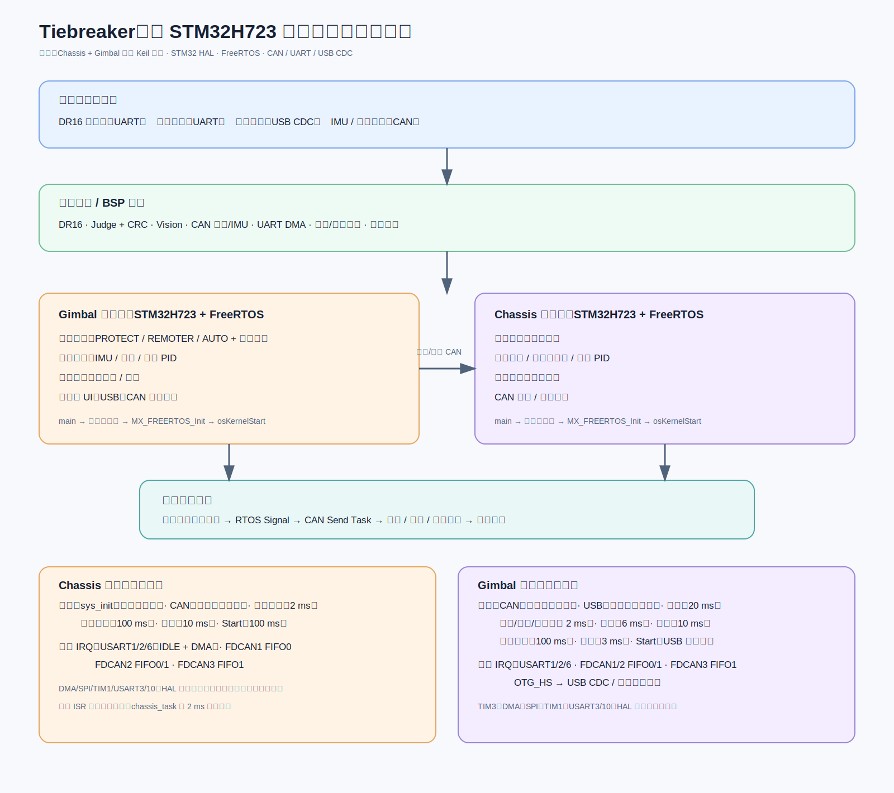

# Tiebreaker：双 STM32 机器人控制系统

> 源码依据：`D:\Git_T\Sentry_me\Tiebreaker`。配套架构图：`Tiebreaker_架构图.svg`。

## 30 秒开场

这是一个基于两颗 **STM32H723 Cortex-M7** 的实时机器人控制固件：**Gimbal** 工程负责云台、射击、视觉、裁判系统和整机模式协调，**Chassis** 工程负责底盘运动学、PID、功率与超级电容控制。两侧都基于 STM32 HAL 和 FreeRTOS，通过 CAN 完成电机控制与跨控制器协作。

核心设计是将**控制计算**与**总线发送**拆开：业务任务周期性计算控制量，统一 CAN 发送任务再结合解锁状态、保护模式、裁判功率限制决定是否输出。这让实时控制、功率门控和安全保护能集中维护。

## 架构总览



```text
遥控器 / 裁判系统 / 视觉 / IMU / 电机反馈
       ↓ UART、USB CDC、CAN
协议解析与 BSP 适配（DR16、Judge、Vision、CAN、IMU、Power）
       ↓
Gimbal STM32H723 + FreeRTOS  ←── CAN ──→  Chassis STM32H723 + FreeRTOS
模式、云台、射击、视觉、裁判任务              底盘、功率、状态、CAN 任务
       ↓                                           ↓
       └──── PID / 运动学 / 电流指令 / 统一 CAN 发送 ────┘
                              ↓
                   云台、射击与底盘执行机构
```

## 源码支撑的技术栈

| 维度 | 结论 | 关键源码 |
| --- | --- | --- |
| MCU 与工程 | 两个 Keil 固件目标，均为 STM32H723VGTx / Cortex-M7 | `Chassis/MDK-ARM/rm_main.uvprojx`、`Gimbal/MDK-ARM/rm_main.uvprojx` |
| 基础软件 | C、STM32 HAL、CMSIS-RTOS 风格 API、FreeRTOS | `Gimbal/Core/Inc/FreeRTOSConfig.h` |
| 硬件接口 | FDCAN、UART + DMA、SPI、GPIO、USB Device CDC、TIM | 两侧 `Core/Src/main.c`、`Gimbal/Core/Src/fdcan.c` |
| 控制算法 | PID、滤波/Kalman、底盘运动学与速度分配 | `User/Math/`、`chassis_task.c`、`gimbal_task.c` |

## 启动与调度

### 两侧共同模式

`main()` 负责 HAL、时钟、外设和业务模块初始化，然后调用 `MX_FREERTOS_Init()` 与 `osKernelStart()`。业务不跑在裸机 `while(1)` 中，而是由 RTOS 任务调度。

### Gimbal 启动重点

`Gimbal/Core/Src/main.c` 还会初始化 `chassis_init()`、`shoot_init()`、`gimbal_param_init()`、串口/CAN 通信、功率控制、USB FIFO 与 USB Device。

### 核心任务

| 任务域 | 职责 | 关键文件 |
| --- | --- | --- |
| 模式管理 | 维护 `PROTECT` / `REMOTER` / `AUTO` 与 `lock_flag`；遥控失联强制保护 | `Gimbal/User/app/modeswitch_task.c` |
| 云台 | 按模式选择策略，结合 IMU、视觉和遥控数据执行串级 PID | `Gimbal/User/app/gimbal_task.c` |
| 底盘 | 模式切换、速度分配、运动学、PID、超级电容/功率控制 | `Chassis/User/app/chassis_task.c` |
| 射击 | 摩擦轮与拨弹机构控制 | `Gimbal/User/app/shoot_task.c` |
| 通信发送 | 汇聚各控制任务 signal，统一发送电机 CAN 指令并做门控 | `Gimbal/User/app_comn/comm_task.c` |
| 跨板协同 | Gimbal 每约 10 ms 将模式、自动控制和超级电容策略发给 Chassis | `Gimbal/User/app/gimbal_to_chassis_task.c` |

## 实际运行任务清单

以下仅统计两个 `Core/Src/freertos.c` 内实际执行 `osThreadCreate()` 的应用任务；仅被 `#include`、仅有实现文件或创建语句被注释的任务不计入运行时架构。

### Chassis：5 个业务任务 + 启动任务

| 任务                  | 优先级/节拍                 | 职责                                            |
| ------------------- | ---------------------- | --------------------------------------------- |
| `sys_init_task`     | Realtime；初始化后自删除       | 初始化 USART、CAN、底盘与功率控制                         |
| `can_msg_send_task` | High；`osSignalWait` 阻塞 | 等待 `CHASSIS_MOTOR_MSG_SEND`，按保护状态输出零电流或底盘电机电流 |
| `chassis_task`      | Normal；2 ms            | 模式选择、速度分配、运动学、PID、超级电容与功率控制，并通知 CAN 发送任务      |
| `status_task`       | Normal；100 ms          | 检查遥控/云台通信状态并维护看门狗与状态标志                        |
| `debug_task`        | Low；10 ms              | 输出调试 Scope 数据                                 |
| `start_task`        | Normal；100 ms          | 空启动循环，无业务处理                                   |

创建点：`Chassis/Core/Src/freertos.c`；控制主循环：`Chassis/User/app/chassis_task.c`；电机发送：`Chassis/User/app_comn/comm_task.c`。

### Gimbal：9 个业务任务 + 启动任务

| 任务                       | 优先级/节拍                 | 职责                                  |
| ------------------------ | ---------------------- | ----------------------------------- |
| `can_msg_send_task`      | High；`osSignalWait` 阻塞 | 汇聚云台、射击、底盘电机发送信号，统一做解锁/保护/功率门控      |
| `usb_task`               | High；CDC 队列阻塞          | 消费 `CDC_send_queue`，发送 USB CDC 数据   |
| `status_task`            | High；20 ms             | 遥控器在线状态、状态 LED、IMU/裁判在线标志维护         |
| `chassis_task`           | AboveNormal；2 ms       | 底盘控制、里程计与裁判数据入列                     |
| `gimbal_task`            | AboveNormal；2 ms       | 模式控制、姿态计算、串级 PID，通知 CAN 输出          |
| `shoot_task`             | AboveNormal；2 ms       | 发射保护、摩擦轮/拨盘与视觉射击控制                  |
| `mode_switch_task`       | Normal；6 ms            | 解锁、拨杆模式切换、自动模式与遥控失联保护               |
| `judge_send_task`        | Normal；100 ms          | 组织裁判 UI、哨兵交互并通过 DMA 发送              |
| `gimbal_to_chassic_task` | Normal；10 ms           | 按模式向 Chassis 下发控制 CAN 帧、裁判数据和超级电容策略 |
| `debug_task`             | Low；3 ms               | 输出云台 PID 与超级电容调试数据                  |
| `start_task`             | Normal；1 ms            | 初始化 USB Device 后保持运行                |

创建点：`Gimbal/Core/Src/freertos.c`。`sys_init_task`、`decode_task` 与 `Auto_Control_task` 的创建代码已注释，不应作为当前运行任务介绍。

## 中断与回调清单

面试讲解应区分“真正进入业务链路的中断”和“仅将硬件事件交给 HAL/DMA 的通用转发中断”。控制任务并不会被 FDCAN 接收中断直接唤醒：ISR 更新电机/IMU/状态共享数据，2 ms 控制任务在下一周期读取。

### Chassis 业务中断

| 中断入口 | 链路 | 业务结果 |
| --- | --- | --- |
| `USART1_IRQHandler` | HAL UART → `usart_user_handler` → UART IDLE + DMA | DBUS 遥控帧进入 FIFO |
| `USART2_IRQHandler` | HAL UART → `usart_user_handler` → UART IDLE + DMA | 裁判系统数据进入解析 |
| `USART6_IRQHandler` | HAL UART → `usart_user_handler` | 用户串口处理 |
| `FDCAN1_IT0_IRQHandler` | HAL FDCAN → FIFO0 回调 | 6020 等电机反馈 |
| `FDCAN2_IT0/IT1_IRQHandler` | HAL FDCAN → FIFO 回调 | 超级电容/底盘控制与裁判功率数据 |
| `FDCAN3_IT1_IRQHandler` | HAL FDCAN → FIFO1 回调 | 四个 3508 底盘电机反馈 |

### Gimbal 业务中断

| 中断入口 | 链路 | 业务结果 |
| --- | --- | --- |
| `USART1_IRQHandler` / `USART2_IRQHandler` / `USART6_IRQHandler` | HAL UART → 用户处理 → IDLE + DMA | 遥控器、裁判系统和用户串口数据 |
| `FDCAN1_IT0/IT1_IRQHandler` | HAL FDCAN → FIFO 回调 → `T_imu_calcu` | 底盘 IMU、姿态与角度数据 |
| `FDCAN2_IT0/IT1_IRQHandler` | HAL FDCAN → FIFO 回调 | 拨盘、底盘 yaw、摩擦轮反馈 |
| `FDCAN3_IT1_IRQHandler` | HAL FDCAN → FIFO 回调 | pitch 与 gimbal yaw 电机反馈 |
| `OTG_HS_IRQHandler` | HAL PCD → USB Device CDC 回调 | USB CDC 端点收发与视觉数据解包 |

### 通用转发项

`DMA1_Stream0..7`、`DMA2_Stream0..2`、`SPI1_IRQHandler`、`TIM1_UP_IRQHandler`、`USART3_IRQHandler`、`USART10_IRQHandler` 在当前 ISR 文件中主要调用 HAL。`TIM1_UP_IRQHandler` 用作 HAL tick；Gimbal 的 `TIM3_IRQHandler` 也只有 HAL 转发。它们应在图中合并为“HAL / DMA 服务”，不要误讲为控制算法中断。

当前主 CAN 回调路径为 `User/communication/can_comm.c` 中的 `HAL_FDCAN_RxFifo0Callback` / `HAL_FDCAN_RxFifo1Callback`；`User/bsp/bsp_can.c` 内并存旧式 `HAL_CAN_*` 路径，面试中不作为第二条并行运行链路介绍。

## 三条讲解主线

### 1. 遥控/自动控制链路

`DR16 → 协议解析 → mode_switch_task → ctrl_mode / lock_flag → chassis_task、gimbal_task、shoot_task → PID/运动学 → 电机电流`。

失联保护是关键安全点：遥控器异常时模式切到 `PROTECT_MODE`，同时取消解锁，避免执行机构误动作。

### 2. 视觉与裁判系统链路

- 视觉通过 USB CDC 进入 `prot_vision.c`，处理帧尾、重复帧、目标 yaw/pitch/distance 与开火许可；IMU、射速和阵营信息也会反向发给视觉端。
- 裁判系统通过 UART 帧进入 `prot_judge.c`，经帧头、CRC8 与命令 ID 分发更新比赛、机器人、功率热量和弹药数据；这些数据约束功率和射击策略，并驱动 UI/小地图等发送。

### 3. 统一电机输出与跨板协作

控制任务不直接把数据发到总线，而是写入电流缓冲区并 `osSignalSet()`。`can_msg_send_task` 汇聚云台、射击、底盘的发送请求，再检查当前模式、`lock_flag`、裁判功率条件和在线状态后调用 CAN 电机控制接口。

这能将总线操作从控制环剥离，并把安全/功率策略放在唯一出口。

## 面试可强调的设计取舍

1. **双控制器分工**：把高频底盘控制与云台/射击/视觉/裁判的复杂协同拆分，降低单板耦合；CAN 保留跨板命令通路。
2. **实时任务化**：周期控制任务比大 `while(1)` 更利于保证控制节拍，也便于扩展状态、调试和通信功能。
3. **输出集中门控**：统一 CAN 发送点天然适合处理断连、未解锁与功率限制，不让每个业务任务重复实现保护。
4. **多源状态融合**：遥控器决定人工模式，视觉服务自动瞄准，裁判系统提供比赛/功率约束；模式状态机负责把它们收束为可执行策略。
